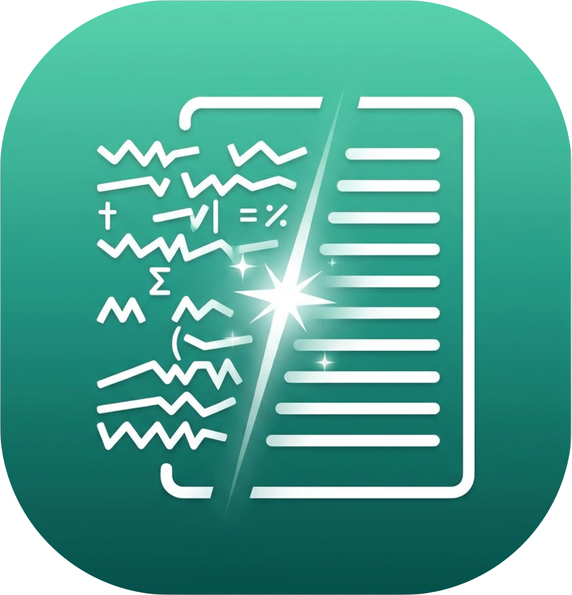
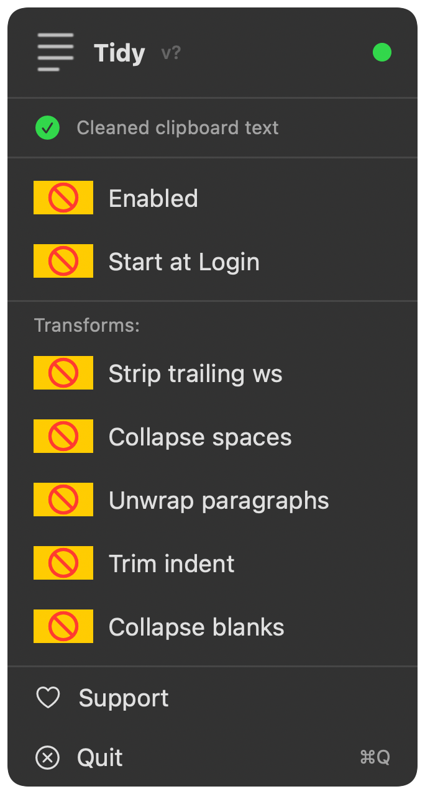

<div align="center">
<h1>Tidy</h1>



<p>Automatically clean up messy clipboard text on macOS</p>
</div>

---

<p align="center">
  
</p>

## Why?

Text copied from terminals, markdown editors, and AI tools arrives full of formatting artifacts: soft-wrapped lines with leading spaces, multiple consecutive spaces, trailing whitespace, and excessive blank lines. Pasting into Google Docs or Slack produces messy results.

Tidy fixes it automatically. Copy text, paste clean text. No action needed.

## Install

**Build from source**:
```bash
git clone https://github.com/maferland/tidy.git
cd tidy
make install
```

## Usage

Run `Tidy`. An icon appears in your menu bar. That's it.

- **Enabled/Disabled** — Master toggle for all cleaning
- **Start at Login** — Run automatically when you log in
- **Per-transform toggles** — Enable/disable individual transforms

## What Gets Cleaned

| Transform | What it does |
|-----------|-------------|
| Strip trailing ws | Removes trailing spaces/tabs from each line |
| Collapse spaces | `hello    world` becomes `hello world` (preserves leading indent) |
| Unwrap paragraphs | Joins soft-wrapped continuation lines back into paragraphs |
| Trim indent | Strips common leading whitespace across all lines |
| Collapse blanks | Multiple blank lines become a single blank line |

**Preserved:** List items, headings, code fences, paragraph boundaries.

## Privacy

Tidy runs entirely on your Mac. No network requests. No data collection. No analytics.

## Requirements

- macOS 14 (Sonoma) or later

## Support

If Tidy cleans up your life, consider buying me a coffee:

[](https://buymeacoffee.com/maferland)

## License

MIT — see [LICENSE](LICENSE)
